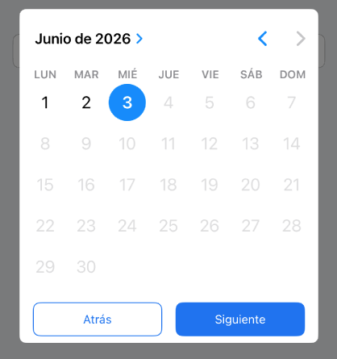
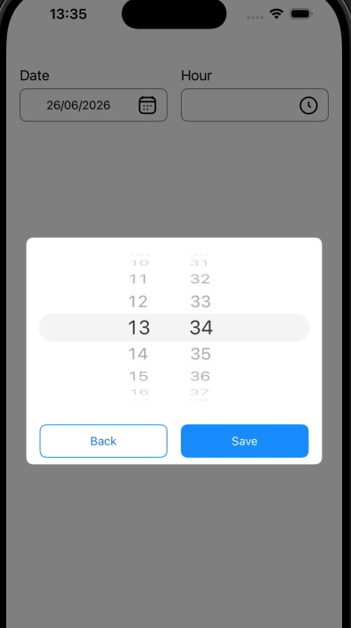

# DHLCustomDatePicker

Date/hour selector.


## Preview






## Installation

### CocoaPods

```ruby
pod 'DHLCustomDatePicker'
```

## Quick Start

### UIKit

```swift
@IBOutlet weak var myDatePicker: DHLCustomDatePicker!

myDatePicker.setUp(parent: self, type: .date, datePickedAction: { selectedDate in
            
})

myDatePicker.setDate(Date())
```
